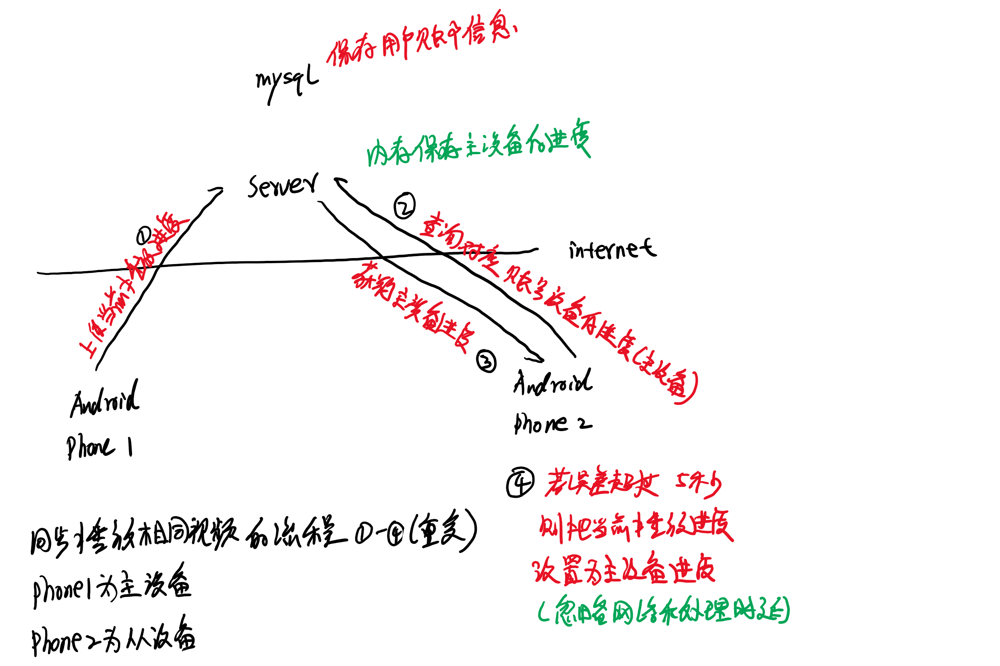

# 项目功能
1. 开发一个视频同步播放的Android软件，方便我(me)和女友(gf)看电影
2. 一个story是：
   1. 打开本软件，同步播放电影文件
   2. 打开微信，开源进行声音交流
   3. 能够听到电影的声音和微信中的声音

# 总体架构设计

# 后端服务子系统
1. app的数据使用MySQL来保存，需要保存的数据有
   1. 账户和密码
   2. 登录时间

# Android子系统
1. 登录
2. 选择视频
3. 播放视频

# TODO
> 1. client指Android APP
> 1. server指后端服务器
1. [ ] 登录
   1. client传递注册信息到server: account, password
   2. 如果没有该用户信息将自动注册，密码要加盐保存到MySQL user表
   3. 对比密码的[sha3](https://keccak.team/software.html)值判断登录是否成功，使用[lib](https://github.com/aelstad/keccakj)
2. [ ] 修改密码
3. [x] 忘记密码，不需要支持该功能，重新注册另外一个账户即可

# 参考文档
1. [连接MySQL数据库](https://www.programmersought.com/article/40737747463/)